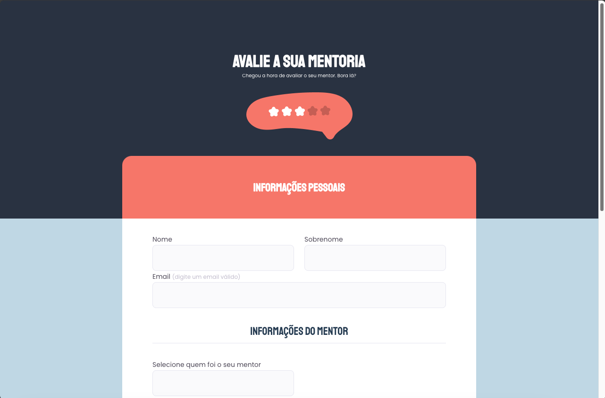

<h1 align="center"> # Explorer - S03 - Mentoria-2 </h1>

Exercício desafio do stage 03-Formulários do curso Explorer da rocketseat

## 🚀 Tecnologias

Esse projeto foi desenvolvido com as seguintes tecnologias:

- HTML e CSS
- Git e Github
- Figma
  

## Conceitos utilizados

Foram utilizados os seguintes conceitos e resources:

- Transition
- Cursor - pointer
- Alterar checkbox padrão pseudoclasses
- Acessibilidade escurecendo labels com hover
  

## 💻 Preview

  

